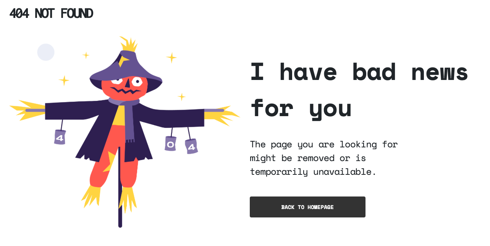

<!-- Please update value in the {}  -->

<h1 align="center">{Your project name}</h1>

   Solution for a challenge from  <a href="http://devchallenges.io" target="_blank">Devchallenges.io</a>.

  <h3>
    <a href="https://htmlpreview.github.io/?https://github.com/jqquah/404-not-found/blob/main/404.html">
      Demo
    </a>
     | 
    <a href="https://github.com/jqquah/404-not-found/blob/main/404.html">
      Solution
    </a>
     | 
    <a href="https://devchallenges.io/challenges/wBunSb7FPrIepJZAg0sY">
      Challenge
    </a>
  </h3>

<!-- TABLE OF CONTENTS -->

## Table of Contents

- [Overview](#overview)
  - [Built With](#built-with)
- [Features](#features)
- [Contact](#contact)
- [Acknowledgements](#acknowledgements)

<!-- OVERVIEW -->

## Overview

This is a sample 404 page made under dev-challenge #1. You may check out the [demo](https://htmlpreview.github.io/?https://github.com/jqquah/404-not-found/blob/main/404.html) here.

It was a simple one using only bootstrap's flex properties.

### Built With

<!-- This section should list any major frameworks that you built your project using. Here are a few examples.-->

- [Bootstrap](https://getbootstrap.com)

## Features

<!-- List the features of your application or follow the template. Don't share the figma file here :) -->

This application/site was created as a submission to a [DevChallenges](https://devchallenges.io/challenges) challenge. The [challenge](https://devchallenges.io/challenges/wBunSb7FPrIepJZAg0sY) was to build an application to complete the given user stories.

## Acknowledgements

<!-- This section should list any articles or add-ons/plugins that helps you to complete the project. This is optional but it will help you in the future. For exmpale -->

- [Bootstrap documentation](https://getbootstrap.com/docs/5.1/getting-started/introduction/)

## Contact

- Website [your-website.com](https://{your-web-site-link})
- GitHub [@jqquah](https://{github.com/jqquah})
- Twitter [@jqquah](https://{twitter.com/jqquah})
